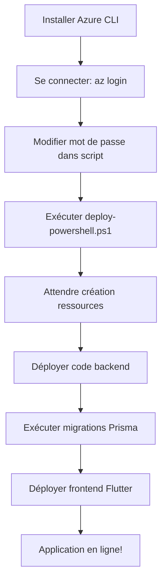

# 🚀 Guide Complet de Déploiement - École Assalam

Bienvenue ! Ce guide vous aide à déployer l'application École Assalam sur Azure Linux en quelques étapes simples.

## 📋 Table des matières

1. [Démarrage Rapide (10 minutes)](#démarrage-rapide)
2. [Prérequis](#prérequis)
3. [Options de Déploiement](#options-de-déploiement)
4. [Déploiement sur Azure (Recommandé)](#déploiement-sur-azure)
5. [Alternative Docker](#alternative-docker)
6. [Vérification](#vérification)
7. [Dépannage](#dépannage)

---

## 🎯 Démarrage Rapide

### Vous avez Windows et voulez déployer sur Azure ?

**Suivez ces 5 étapes simples :**

#### 1. Installer Azure CLI

Ouvrez PowerShell **en tant qu'administrateur** et exécutez :

```powershell
Invoke-WebRequest -Uri https://aka.ms/installazurecliwindows -OutFile .\AzureCLI.msi
Start-Process msiexec.exe -Wait -ArgumentList '/I AzureCLI.msi /quiet'
Remove-Item .\AzureCLI.msi
```

**Redémarrez PowerShell !**

#### 2. Se connecter à Azure

```powershell
az login
```

Votre navigateur s'ouvrira pour l'authentification.

#### 3. Modifier le mot de passe

Éditez le fichier `deployment\azure\deploy-powershell.ps1` ligne 11 :

```powershell
$DB_ADMIN_PASSWORD = "VotreMotDePasseSecurise123!"
```

#### 4. Lancer le déploiement

```powershell
cd "C:\Users\ghozz\Desktop\entreprise\Projects\Ecole Assalam\ecole-assalam-app\deployment\azure"
.\deploy-powershell.ps1
```

⏱️ **Attendez 10-15 minutes...**

#### 5. Déployer le code

```powershell
# Backend
cd ..\..\backend
az webapp up --name ecole-assalam-backend --resource-group ecole-assalam-rg

# Migrations
az webapp ssh --resource-group ecole-assalam-rg --name ecole-assalam-backend
# Dans le terminal SSH :
cd /home/site/wwwroot && npm run prisma:migrate
```

✅ **C'est terminé !** Votre application est en ligne !

**URLs :**
- Backend : https://ecole-assalam-backend.azurewebsites.net
- Frontend : https://ecole-assalam-frontend.azurewebsites.net

---

## 📚 Prérequis

### Pour déploiement sur Azure

- ✅ Compte Azure ([Créer un compte gratuit](https://azure.microsoft.com/free/) - 200$ de crédit)
- ✅ Azure CLI installé
- ✅ PowerShell ou Bash

### Pour déploiement Docker

- ✅ Docker Desktop (Windows/Mac) ou Docker Engine (Linux)
- ✅ Docker Compose

### Pour développement local

- ✅ Node.js 20+
- ✅ PostgreSQL 14+
- ✅ Flutter SDK

---

## 🎭 Options de Déploiement

| Option | Difficulté | Coût/mois | Temps | Pour qui ? |
|--------|-----------|-----------|-------|-----------|
| **Azure** | ⭐⭐ | 28€ | 15 min | Production professionnelle |
| **Docker** | ⭐⭐⭐ | Variable | 30 min | Contrôle total |
| **Vercel + Supabase** | ⭐ | 0-25€ | 20 min | Tests rapides |
| **DigitalOcean** | ⭐⭐ | 12-20€ | 25 min | Alternative économique |

### ➡️ Je recommande **Azure** pour vous car :

1. ✅ **Guide complet fourni** - Vous avez tous les scripts
2. ✅ **Crédit gratuit** - 200$ offerts pour nouveaux comptes
3. ✅ **Infrastructure professionnelle** - Scalable et sécurisée
4. ✅ **Support Azure** - Documentation exhaustive

---

## 🌟 Déploiement sur Azure

### Méthode complète

**Documentation complète :** [deployment/azure/QUICKSTART.md](deployment/azure/QUICKSTART.md)

### Résumé des étapes



### Commandes essentielles

```powershell
# Voir les logs
az webapp log tail --resource-group ecole-assalam-rg --name ecole-assalam-backend

# Redémarrer
az webapp restart --resource-group ecole-assalam-rg --name ecole-assalam-backend

# Arrêter (pour économiser)
az webapp stop --resource-group ecole-assalam-rg --name ecole-assalam-backend
az postgres flexible-server stop --resource-group ecole-assalam-rg --name ecole-assalam-db

# Supprimer tout
az group delete --name ecole-assalam-rg --yes
```

---

## 🐳 Alternative Docker

### Avantages Docker

- ✅ Fonctionne partout (local, cloud, VPS)
- ✅ Environnement reproductible
- ✅ Facile à migrer

### Démarrage rapide avec Docker

```bash
cd deployment/docker

# Créer le fichier .env
echo "DB_PASSWORD=VotreMotDePasse123!" > .env

# Lancer
docker-compose up -d

# Vérifier
docker-compose ps
```

**URLs locales :**
- Frontend : http://localhost:8080
- Backend : http://localhost:3000

**Documentation :** [deployment/docker/README.md](deployment/docker/README.md)

---

## ✅ Vérification

### Tester le Backend

```bash
curl https://ecole-assalam-backend.azurewebsites.net
```

Réponse attendue :
```json
{
  "message": "API École Assalam",
  "version": "1.0.0",
  "endpoints": { ... }
}
```

### Tester le Frontend

Ouvrez dans votre navigateur :
```
https://ecole-assalam-frontend.azurewebsites.net
```

Vous devriez voir l'écran d'accueil avec 4 cartes (Niveaux, Groupes, Élèves, Examens).

### Créer vos premières données

1. **Créer un niveau**
   - Cliquez sur "Niveaux"
   - Bouton "+"
   - Nom: "CP", Ordre: 1
   - Créer

2. **Créer un groupe**
   - Cliquez sur "Groupes"
   - Bouton "+"
   - Nom: "CP-A", Niveau: CP, Capacité: 30
   - Créer

3. **Ajouter un élève**
   - Cliquez sur "Élèves"
   - Bouton "+"
   - Remplir le formulaire
   - Créer

---

## 🆘 Dépannage

### Problème 1 : "az command not found"

**Solution :**
1. Vérifiez que Azure CLI est installé : `az --version`
2. Redémarrez PowerShell
3. Réinstallez si nécessaire

### Problème 2 : Erreur de connexion à la base de données

**Solution :**
```powershell
# Vérifier le serveur PostgreSQL
az postgres flexible-server show --resource-group ecole-assalam-rg --name ecole-assalam-db

# Vérifier les paramètres de connexion
az webapp config appsettings list --resource-group ecole-assalam-rg --name ecole-assalam-backend
```

### Problème 3 : L'application ne démarre pas

**Solution :**
```powershell
# Voir les logs détaillés
az webapp log tail --resource-group ecole-assalam-rg --name ecole-assalam-backend

# Télécharger tous les logs
az webapp log download --resource-group ecole-assalam-rg --name ecole-assalam-backend --log-file logs.zip
```

### Problème 4 : Erreur CORS

**Solution :**
```powershell
az webapp cors add `
  --resource-group ecole-assalam-rg `
  --name ecole-assalam-backend `
  --allowed-origins "https://ecole-assalam-frontend.azurewebsites.net"
```

### Problème 5 : Les migrations Prisma échouent

**Solution :**
```powershell
# Se connecter en SSH
az webapp ssh --resource-group ecole-assalam-rg --name ecole-assalam-backend

# Dans le terminal SSH
cd /home/site/wwwroot
npm run prisma:generate
npm run prisma:migrate
```

---

## 💰 Gestion des coûts

### Coûts Azure estimés

- **App Service Plan B1** : ~13€/mois
- **PostgreSQL Flexible Server B1ms** : ~15€/mois
- **Total** : **~28€/mois**

### Réduire les coûts

#### Option 1 : Arrêter quand inutilisé

```powershell
# Arrêter tout
az webapp stop --resource-group ecole-assalam-rg --name ecole-assalam-backend
az webapp stop --resource-group ecole-assalam-rg --name ecole-assalam-frontend
az postgres flexible-server stop --resource-group ecole-assalam-rg --name ecole-assalam-db

# Redémarrer
az webapp start --resource-group ecole-assalam-rg --name ecole-assalam-backend
az webapp start --resource-group ecole-assalam-rg --name ecole-assalam-frontend
az postgres flexible-server start --resource-group ecole-assalam-rg --name ecole-assalam-db
```

#### Option 2 : Utiliser le niveau gratuit F1

Modifiez `deploy-powershell.ps1` :
```powershell
--sku F1  # Au lieu de B1
```

**Note :** Le niveau F1 a des limitations (60 min CPU/jour, 1 GB RAM)

#### Option 3 : Utiliser Azure for Students

Si vous êtes étudiant : [Azure for Students](https://azure.microsoft.com/free/students/) - 100$ de crédit gratuit

---

## 📊 Monitoring

### Activer Application Insights

```powershell
# Créer Application Insights
az monitor app-insights component create `
  --app ecole-assalam-insights `
  --location francecentral `
  --resource-group ecole-assalam-rg

# Lier à l'App Service
$INSTRUMENTATION_KEY = az monitor app-insights component show `
  --app ecole-assalam-insights `
  --resource-group ecole-assalam-rg `
  --query instrumentationKey -o tsv

az webapp config appsettings set `
  --resource-group ecole-assalam-rg `
  --name ecole-assalam-backend `
  --settings APPINSIGHTS_INSTRUMENTATIONKEY=$INSTRUMENTATION_KEY
```

### Voir les métriques

1. Allez sur [portal.azure.com](https://portal.azure.com)
2. Naviguez vers votre App Service
3. Cliquez sur "Monitoring" → "Metrics"

---

## 🔒 Sécurité

### Configurer HTTPS uniquement

```powershell
az webapp update `
  --resource-group ecole-assalam-rg `
  --name ecole-assalam-backend `
  --https-only true
```

### Ajouter un domaine personnalisé

```powershell
# Ajouter le domaine
az webapp config hostname add `
  --webapp-name ecole-assalam-backend `
  --resource-group ecole-assalam-rg `
  --hostname api.votre-domaine.com

# Configurer SSL
az webapp config ssl bind `
  --certificate-thumbprint <thumbprint> `
  --ssl-type SNI `
  --name ecole-assalam-backend `
  --resource-group ecole-assalam-rg
```

---

## 📖 Documentation complète

### Guides détaillés

- 📘 [Azure - Guide rapide (QUICKSTART)](deployment/azure/QUICKSTART.md) ⭐ **Commencez ici !**
- 📗 [Azure - Documentation complète](deployment/azure/README.md)
- 📙 [Docker - Guide complet](deployment/docker/README.md)
- 📕 [Architecture de l'application](ARCHITECTURE.md)

### Fichiers importants

```
ecole-assalam-app/
├── deployment/
│   ├── azure/
│   │   ├── QUICKSTART.md          ⭐ Guide rapide Azure
│   │   ├── README.md              Documentation Azure
│   │   ├── deploy.sh              Script Linux
│   │   └── deploy-powershell.ps1  Script Windows
│   ├── docker/
│   │   ├── README.md              Guide Docker
│   │   ├── docker-compose.yml
│   │   ├── Dockerfile.backend
│   │   └── Dockerfile.frontend
│   └── DEPLOYMENT_SUMMARY.md      Comparaison des options
├── DEPLOYMENT_GUIDE.md            📍 Vous êtes ici
├── GUIDE_DEMARRAGE.md             Guide développement local
└── ARCHITECTURE.md                Architecture technique
```

---

## 🎓 Prochaines étapes

Après le déploiement réussi :

1. ✅ **Configurer les sauvegardes**
2. ✅ **Ajouter l'authentification**
3. ✅ **Configurer CI/CD avec GitHub Actions**
4. ✅ **Ajouter un domaine personnalisé**
5. ✅ **Configurer le monitoring**

---

## 🤝 Support

### Questions fréquentes

**Q : Combien coûte Azure ?**
R : ~28€/mois avec les tiers recommandés. Compte gratuit avec 200$ de crédit.

**Q : Puis-je utiliser un autre fournisseur cloud ?**
R : Oui ! Voir [DEPLOYMENT_SUMMARY.md](deployment/DEPLOYMENT_SUMMARY.md) pour les alternatives.

**Q : Comment sauvegarder ma base de données ?**
R : Azure fait des sauvegardes automatiques. Voir la documentation PostgreSQL Flexible Server.

**Q : L'application est-elle sécurisée ?**
R : Oui, avec HTTPS, firewall PostgreSQL, et bonnes pratiques de sécurité.

### Ressources

- [Documentation Azure](https://docs.microsoft.com/azure/)
- [Support Azure](https://azure.microsoft.com/support/)
- [Forum Flutter](https://flutter.dev/community)
- [Prisma Docs](https://www.prisma.io/docs/)

---

## 🚀 C'est parti !

**Prêt à déployer ?**

👉 Suivez le guide rapide : [deployment/azure/QUICKSTART.md](deployment/azure/QUICKSTART.md)

**Bon déploiement ! 🎉**
